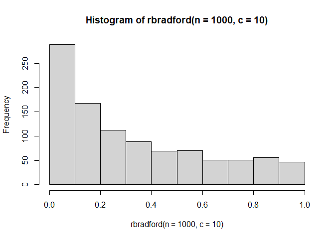

<!-- README.md is generated from README.Rmd. Please edit that file -->

# bradfordr (WIP)

<!-- badges: start -->

# bradfordr 

<!-- badges: end -->

The goal of bradfordr is to implement probability functions from the
Standardized Bradford Distribution in the same way other distributions
are implemented in the `{stats}` package. It’s definition and
functionality were taken from
[SciPy](https://docs.scipy.org/doc/scipy/reference/generated/scipy.stats.bradford.html).

## Definition of the Standardized Bradford Distribution

A continuous random variable follows the Standardized Bradford
Distribution if it’s probability density function is given as the
following:

<a href="https://www.codecogs.com/eqnedit.php?latex=\bg_white&space;\fn_cm&space;\LARGE&space;f(x;c)&space;=&space;\frac{c}{log(1&space;&plus;&space;c)&space;\cdot&space;(1&space;&plus;&space;c&space;\cdot&space;x)}" target="_blank"></a>

For 0 ≤ *x* ≤ 1 and *c* &gt; 0.

It comes primarily from [Bradford’s law of
scattering](https://docs.scipy.org/doc/scipy/reference/generated/scipy.stats.bradford.html),
which states that, if journals in a specific field are sorted into three
groups (each with one third of all articles of that field), the number
of journals in each group will be proportional to
1 : *n* : *n*<sup>2</sup>. The Bradford Distribution itself is a special
case of the Pareto Distribution, and has some relations with the
Exponential Distribution.

## Installation

You can install the development version of bradfordr from
[GitHub](github.com) with:

``` r
# install.packages("devtools")
devtools::install_github("victordogo/bradfordr")
```

## Example

`{bradfordr}` contains 4 basic functions, exemplified below:

### rbradford

The `rbradford` function generates a vector of values from the
Standardized Bradford Distribution with length `n` and parameter `c`
using the [Inverse Transform Sampling
Method](https://en.wikipedia.org/wiki/Inverse_transform_sampling).

The standard value for `c` is 5:

``` r
library(bradfordr)

rbradford(n=10)
#>  [1] 0.26289643 0.07324243 0.23642474 0.02581323 0.72384486 0.20993432
#>  [7] 0.20379770 0.20078451 0.11035517 0.14700230
```

If the value of c is less or equal than 0, the function returns an
error:

``` r
rbradford(n=10, c=0)
#> [1] "Error: c parameter must be greater than 0."
```

These values can be used to plot a histogram, for an example:

``` r
hist(rbradford(n=1000, c=10))
```



## Meaning of logo

> “I am Wan Shi Tong, he who knows ten thousand things, and you are
> obviously humans; which, by the way, are no longer permitted in my
> study.”

Wan Shi Tong is a wise spirit from the popular acclaimed series “Avatar:
The Last Airbender” and its sequel, “Avatar: The Legend of Korra”. In
both series, its task is to guard and mantain the Spirit Library, in
which almost all knowledge of the world is kept shut from dangerous and
unwanted guests.

Because the Bradford Distribution comes from a law that describes, in a
kind of stretch, *knowledge and its distribution*, I figured that it
would be nice to reference a series I love.
